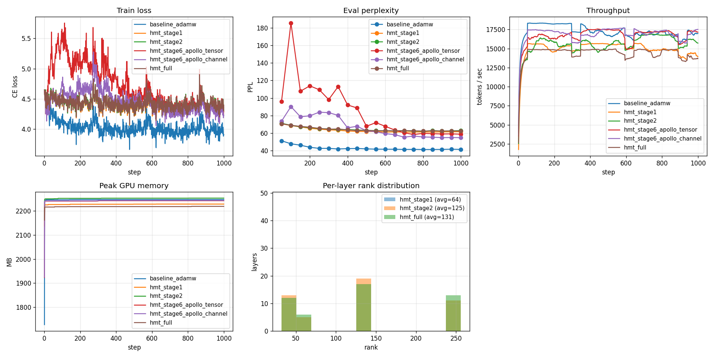

# 2026-04-30 측정 보고서

본 보고서는 RTX 4070 Laptop GPU(8GB VRAM, CUDA 12.7) 환경에서 진행한
세 가지 측정 결과를 한 곳에 모은 것이다. 자세한 코드 경로와 follow-up은
[../../../TODO.md](../../../TODO.md) / [../../../BACKLOG.md](../../../BACKLOG.md) 참조.

| 측정 | 산출물 | 비고 |
|---|---|---|
| 1. Stage 1.6 / 3.5 peak VRAM | [peak_mem_small.json](peak_mem_small.json), [peak_mem_large.json](peak_mem_large.json) | 합성 stacked-Linear 모델 (small: hidden=1024 / large: hidden=1536, seq=2048) |
| 2. F.1 m/v alignment K-sweep | [k_sweep.json](k_sweep.json) | hidden=32, rank=8, 300 step × 6 K값 × 3 seed |
| 3. 1k-step optimizer ablation | [ablation_1k.json](ablation_1k.json), [ablation_1k_compare.png](ablation_1k_compare.png) | 6 configs × 1000 step, pythia-160m / wikitext-2 |

환경: Python 3.11.14, PyTorch 2.6.0+cu124, transformers 5.7.0, uv 0.9.18.

---

## 1. Stage 1.6 / 3.5 peak VRAM 측정

스크립트: [scripts/measure_peak_mem.py](../../../scripts/measure_peak_mem.py)

### Stage 1.6 — optimizer state peak VRAM

`AdamW` (dense) vs `LowRankAdamW two_sided rank=64` on 24-layer 1024×1024 stacked Linear, bf16, batch×seq = 2×1024.

| optimizer | peak VRAM | state 원소 수 |
|---|---|---|
| `adamw_dense` | **320.25 MB** | 50,331,672 |
| `lowrank_two_sided_r64` | **272.25 MB** | 196,608 |

- state 원소 수는 **256× 감소** ✅ (이론치 일치: r²/(out·in) = 64²/1024² = 1/256)
- **peak VRAM은 1.18× 감소만 관찰** — eager 모드의 `projector.reconstruct(low_update)`가 매 step full-shape 임시 텐서를 할당하기 때문
- BACKLOG **F.7**(transient memory) — Stage 5 fused Triton kernel(in-place `W -= η·P U Q.T`)이 닫아야 할 격차

### Stage 3.5 — activation memory peak VRAM

dense `nn.Linear` vs `CompressedLinear`(INT8 활성화) on 동일 stack.

| 구성 | dense_linear | compressed_int8 | 비율 |
|---|---|---|---|
| with ReLU between layers | 188 MB | **335 MB** | **0.56×** (압축이 더 큼) |
| pure Linear stack (no ReLU) | 184 MB | 247 MB | 0.75× (여전히 압축이 큼) |

**왜 INT8 압축이 peak를 늘리는가?**
- `compress_blockwise_int8`이 `x.float()`, `(x_f / scale)` 등 full-size **fp32 transient**를 만든다 (~4× BF16 메모리)
- `decompress_blockwise_int8`도 fp32 → BF16 캐스팅 chain으로 transient 추가
- ReLU가 같은 활성화를 BF16으로 별도 저장하면서 **이중 저장** 발생 (with-ReLU 시 더 악화)
- **저장된 활성화는 줄지만 (~50%) compress/decompress 임시 메모리가 그 절감을 상쇄**

→ Stage 5 Triton fused quantize/dequantize kernel로만 진정한 peak 절감 가능.

---

## 2. F.1 m/v alignment K-sweep

스크립트: [scripts/k_sweep.py](../../../scripts/k_sweep.py)

`LayerProjector.refresh_`로 P, Q를 갈아끼울 때 m, v를 옛 basis → 새 basis로 회전.
`LowRankAdamW.realign_state` 추가, `refresh_projectors_from_grads(..., align_state=True)` 기본 활성.

`m`은 정확 회전(`L @ m @ R`), `v`는 element-wise squared 근사(`(L*L) @ v @ (R*R)`).

토이 stack(hidden=32, rank=8, 300 step), 3 seed 평균:

| K (refresh interval) | aligned mean | unaligned mean | delta (양수 = aligned 우위) |
|---|---|---|---|
| 2 | 4.347 | 4.423 | **+0.076** |
| 4 | 4.483 | 4.415 | -0.069 |
| 8 | 4.608 | 4.442 | -0.165 |
| 16 | 4.455 | 4.358 | -0.097 |
| 50 | 4.138 | 4.103 | -0.034 |
| 100 | 4.061 | 4.056 | -0.005 |

**관찰**:
- K=2: alignment 명확 우위 (history가 너무 짧아 reset 페널티 큼)
- K=4~16: reset이 약간 우위 (variance의 squared-rotation 근사가 충분히 정확하지 않은 듯)
- K≥50: 둘 다 비슷 (refresh가 드물어 어떤 방식이든 영향 작음)

**결론**: 토이 스케일에서 alignment 효과는 mixed. 후속으로 (a) v reset 변형 추가 후 비교, (b) 실제 모델·long-run에서 재측정 필요.

---

## 3. 1k-step optimizer ablation

스크립트: [scripts/run_matrix.py](../../../scripts/run_matrix.py)

EleutherAI/pythia-160m, wikitext-2-raw-v1, seed=42, lr=2e-5 cosine, bs=1×8, seq=1024.

| Config | train loss@1k | **eval ppl** | peak VRAM | optim state | 비고 |
|---|---|---|---|---|---|
| `baseline_adamw` | 3.91 | **41.34** | 2247 MB | full | AdamW dense — 짧은 run에서 정확도 baseline |
| `hmt_stage6_apollo_channel` | 4.23 | **54.79** | 2243 MB | per-row v | AdamW 다음 우위 — PPL +33% |
| `hmt_stage6_apollo_tensor` | 4.35 | 58.69 | 2242 MB | scalar v | channel보다 약간 손해 |
| `hmt_stage1` (GaLore r=64) | 4.29 | 61.58 | 2228 MB | r×r low-rank | 256× state 감소, PPL +49% |
| `hmt_full` (GaLore+sched+INT8) | 4.33 | 62.34 | 2219 MB | low-rank + INT8 act | 추가 INT8 비용은 ppl +1 정도 |
| `hmt_stage2` (GaLore+sched) | 4.30 | 62.77 | 2253 MB | low-rank (avg r=125) | scheduler가 fixed보다 약간 더 안 좋음 (1k 짧아서?) |

비교 그래프: 

**관찰**:
1. 1k step은 메모리 절감 기법이 정확도를 회복하기엔 짧음 — 10k+ pre-training step에서야 격차가 좁아질 가능성
2. **APOLLO-channel이 의외로 강함** — AdamW 대비 +33% ppl, GaLore 대비 -10% — pareto 우위
3. peak VRAM은 8GB GPU에서 162M 모델이라 거의 동일 (~2.2 GB) — Phase 2~3 (1B+) 모델에서야 진짜 차이가 보일 것
4. INT8 활성화 압축(`hmt_full`)은 stage2 대비 PPL 손실 < 1 — accuracy cost 미미

---

## 후속 작업 (BACKLOG 등록)

1. **10k step long-run** (~8h on RTX 4070, 6 configs) — 정확도 격차 수렴 확인
2. **F.1 v reset 변형** 추가 — `align m only, reset v` 방식과 비교 후 정착
3. **F.7 transient memory** — Stage 5 Triton kernel과 동시 작업, peak VRAM 비율을 state-elems 비율과 가깝게
4. **1B+ 모델 측정** — Phase 2~3, 클라우드 GPU 필요 (Stage 1.6/3.5/6.3 모두 재측정)
